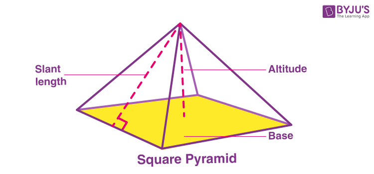
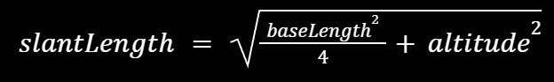
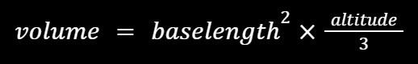

# Project Directions

## Right Square Pyramids **(20 pts)**

Go look at the file `RightSquarePyramid.java` to see the `RightSquarePyramid` class. This is a Right Square Pyramid:

The class is almost ready to use, but has a few key methods unfinished to be able to most effectively work with the objects. You need to fill in the three methods at the bottom of the class: `getSlantLength()`, `getVolume()`, and `getSurfaceArea()`.

To calculate slant length, we use the pythagorean theorem to get this formula:

In the `RightSquarePyramid` class, translate this calculation into Java by using the `Math` class and your class variables `baseLength` and `altitude` to finish the `getSlantLength()` method. **(4 pts)**

To calculate volume, we use the following formula:

In the `RightSquarePyramid` class, translate this calculation into Java by using the `Math` class and your class variables `baseLength` and `altitude` to finish the `getVolume()` method. **(4 pts)**

To calculate surface area, we use the following formula:

In the `RightSquarePyramid` class, translate this calculation into Java by using the `Math` class, your class variables `baseLength` and `altitude`, and the `getSlantLength()` method to finish the `getSurfaceArea()` method. **(4 pts)**

Now make two `RightSquarePyramid` objects with the following dimensions and save them to variables: **(3 pts)**
- Base Length of 14.2 and Altitude of 10.5
- Base Length of 1234.5 and Altitude of 1300.0

For each of these objects, print out the following sentences (use your methods!): **(5 pts)**
- `"The right square pyramid with a base length of # units and an altitude of # units has a volume of # units cubed."`
- `"The right square pyramid with a base length of # units and an altitude of # units has a surface area of # units squared."`

---

## String Manipulation **(20 pts)**

Create a `String` object with the following `String`: `"supercalifragilisticexpialidocious"` **(1 pt)**

Print out the following about the `String` object we just made:
- Print out just `super` from the `String`. **(1 pt)**
- Print out just `docious` from the `String`. **(1 pt)**
- Print out the `String` up until the first instance of the character `x` (including the character `x`). **(2 pts)**
- Print out the `String` after the first instance of the character `r` (not including the character `r` itself). **(2 pts)**
- Print out the `String` between the first instance of `a` and the first instance of `g` (including `a` and `g` themselves). **(3 pts)**

Create each of the following `String` objects: **(3 pts)**
1. `"super"`
2. `"Super"`
3. `"supper"`
4. `"supr"`
5. `"Supr"`

Do the following between the `String` objects you just created:
- Print out the comparison of 1 to 3. **(2 pts)**
- Print out whether 1 and 2 are equal. **(1 pt)**
- Print out the comparison of 4 to 5. **(2 pts)**
- Print out whether 3 and 4 are equal. **(1 pt)**
- Print out whether 3 and 5 are equal. **(1 pt)**